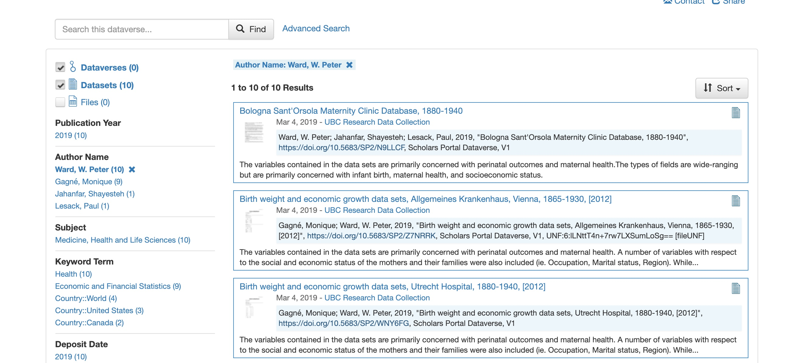
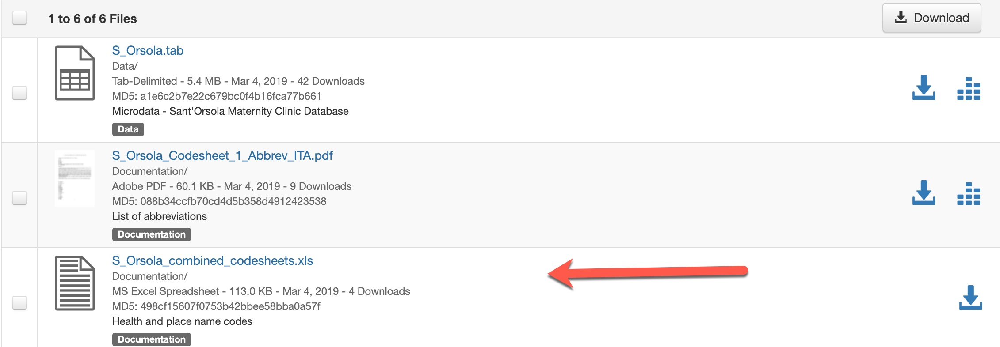
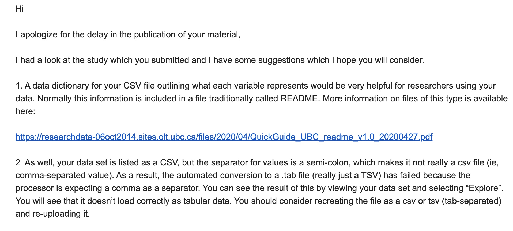

# Dataverse @UBC Library

--- 

# Overview 

- Research data - SP Dataverse 
    - Mediated deposits - Curation  - Allocation of Dataverses
- Licensed data - Abacus Dataverse
    - Authentication - Managing data - API use    
- dryad2dataverse platform
    - Harmonizing data holdings
 
---
# Research Data 
- UBC Library started to work on RDM in 2014
- First deposits were **fully** curated

---
# Research Data 


---
# Research Data 
- Hired a PhD student to do data curation
- Took a lot of time and resources, data dictionaries, recoding
- Data management vs. Data curation

---
# Research Data 


---
# Research Data 
- Fast forward six years
- Mediated deposit
    - Users can login and deposit data
    - RDM Librarian / Analyst review deposits and consult with users to improve
    - Data is published

---
# Research Data 
- Curation
    - Every dataset needs **love**
    - We haven't seen one that does not
    - Commons issues: Lack of data dictionaries - corrupt data files - lacking metadata - no geospatial metadata
    
---
# Research Data
Data Curation, Level 2: 

> Activities that enhance the discoverability of datasets and help ensure their usability over time. E.g., recommended metadata fields are populated and dataset includes sufficient documentation to allow a user with a similar background to understand the dataset and open and use the files.

---
# Research Data


---
# Research Data
- We do allow (and encourage) some research groups to create and manage their own Dataverses
- Examples: 
    - Housing Research Collaborative (20 datasets)
    - Centre for Sustainable Food Systems (22 datasets)
    - Dr. Paul Pavlidis Dataverse (36 datasets)
    - many more...

---
# Licensed Data

---
#dryad2dataverse
- At its simplest, dryad2dataverse is a standalone program that automatically harmonizes research  data between Dryad to Dataverse.
- Requires no effort from researchers who have deposited information into Dryad, making the institutional partnership more valuable.


--- 
#dryad2dataverse
- Hate coding? -- dryad2dataverse also comes with a command line tool, no knowledge of Python or programming is required
- Get started
    -  ```pip install git+https://github.com/ubc-library-rc/dryad2dataverse.git@master```

---
#dryad2dataverse
- [Code] (https://github.com/ubc-library-rc/dryad2dataverse)
- [Documentation] (https://ubc-library-rc.github.io/dryad2dataverse/) 

---
#Questions?


