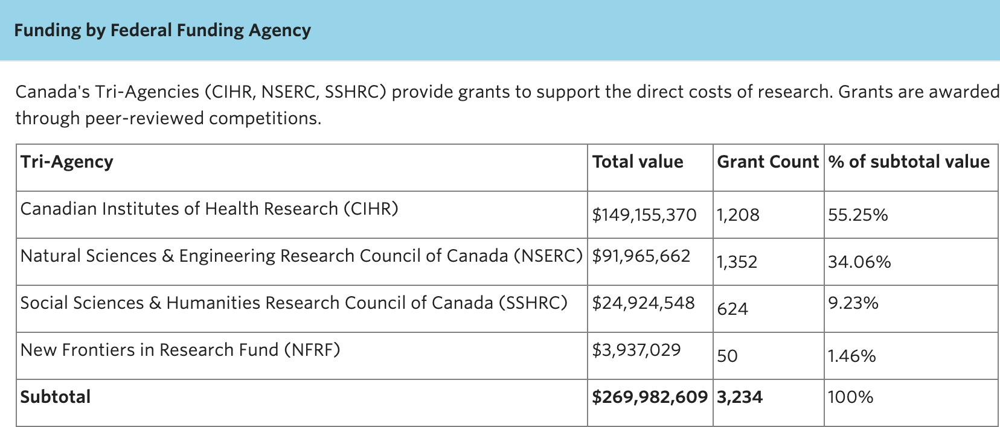
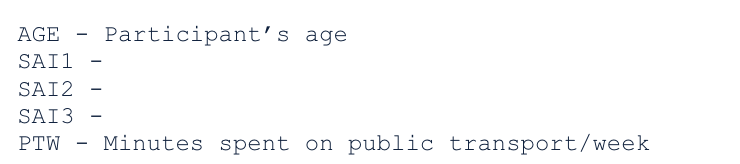
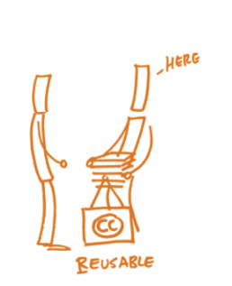

autoscale: true
slidenumbers: true

## Research Data Management -- Introduction
- Eugene Barsky
- UBC Library, Winter 2022
- eugene.barsky@ubc.ca
- https://researchdata.library.ubc.ca/

---

## What is data

---

## Agenda
- Define Research Data
- Research Data & The Data Life Cycle
- Research data management (RDM) – What’s in it for you?
- FAIR Principles for Research Data
- Data Management Plans
- Organizing Data: File Naming, README’s & Metadata
- Storing & Protecting Research Data
- Data Repositories

---

## What is Research Data
- Facts, measurements, observations, recordings, or records, produced during a research project. 
     - Made of many file types, most disciplines have common types:  Notes, numbers, images, designs, algorithms, diagrams, data files, etc. 

---

## Research Data Lifecycle
- Start working with data with an end in-mind

---

## What is Research Data Management
- Processes applied throughout the lifecycle of a research project to guide the collection, documentation, storage, sharing, and preservation of research data.
    - [Portage Network RDM Primer](https://portagenetwork.ca/wp-content/uploads/2019/08/Primer_RDM_August2019_EN.pdf), 2019

---

##Why Prioritize Research Data Management (RDM)?
- RDM helps organize your research data before, during, and after your research cycle. 
Makes responsibilities clear within research team & during team transitions

---

##Why Prioritize Research Data Management (RDM)?
- RDM helps standardize procedures for:
    - Naming
    - Handling 
    - Storing & Locating
    - Sharing  & Publishing

---

##Why Prioritize Research Data Management (RDM)?
- Outlining & implementing RDM is required, or soon will be, by many funding agencies, ethics boards, journals, and UBC. 

---

## Tri-Agency Funding Requires RDM
-As soon as Spring 2022, some Tri-Agency grants will require _research data management plans_ in the application package. 

---

##Tri-Agency Funding Requires RDM

- RDM is the responsibility of the researcher and part of the application process
- The Tri-Agencies already require open access publications and expect open data where possible.

---

##Tri-Agency Funding Requires RDM
Key Policies:

- [Tri-Agency Research Data Management Policy] (https://www.science.gc.ca/eic/site/063.nsf/eng/h_97610.html)
- [Tri-Agency Statement of Principles on Digital Data Management] (https://www.science.gc.ca/eic/site/063.nsf/eng/h_83F7624E.html?OpenDocument)
- [Tri-Agency Open Access Policy on Publications](https://www.science.gc.ca/eic/site/063.nsf/eng/h_F6765465.html)

---

##Good RDM Looks Like:
- Clear distribution of team RDM responsibilities 
- Accurate metadata about each research data file and variable
- A system for data storage, security, and backup
- Plan for data sharing, repository selection, and licensing for reuse
- Uniform and functional standards for naming and organizing data

---

##Good RDM Looks Like:
- My favourite example
- Elizabeth Wolkovich's [Lab Manual](https://github.com/temporalecologylab/labgit/blob/master/datacodemgmt/tempeco_DMP.pdf) 

---

##FAIR Data Supports Open Data

---

## From Here

---

# to Here

---

## Practical Tips (#1) -- Get yourself an ORCID iD
- An ORCID iD is a free, persistent identifier (PID) that you can connect to your published research, including datasets.
- Like a DOI but for you across your entire career
- It makes it easy to gather your attributions, grants, positions, and more in one place
- Register for your ORCID iD here: [https://orcid.org/](https://orcid.org/)

---

##We Need A Data Management Plan (DMP)
- Sets out how you will organize, store and share your research data at each stage in your project and after its conclusion.
- Incoming standard for funding agencies to require these in your grant applications.
    - [Tri-Agency Research Data Management Policy](http://www.science.gc.ca/eic/site/063.nsf/eng/h_97610.html) 

---

##Data Management Plans: What’s In It For You?
- Implementing a DMP allows you to:
    - Clearly delineate who manages your data
    - Define what the transition of data management will look like as team members enter and exit team structure
    - Outline responsibilities and needs in advance to mitigate surprises, including surprise costs or ethics considerations

---
##Data Management Plans: What’s In It For You?
- Think of DMP as the methods for handling your research data, helping to ensure everything is managed identically no matter the handler.

---

##Data Management Plan (DMP) Assistant by Portage
- Free and Bilingual - [DMP Assistant] (https://assistant.portagenetwork.ca/)
- Provides templates tailored to various disciplines
- UBC has custom templates within Portage for UBC researchers
- Templates guide the structure and creation of DMPs, focusing in on what’s most important

---

##DMP Assistant

---

##DMP Exemplars 
- Portage offers examples of completed DMPs. 
- [Exemplars] (https://portagenetwork.ca/tools-and-resources/training-resources/?cn-reloaded=1) - different disciplines

---

##Data Collection
- Thinking about your research data:
    - What types of data will you collect, create, acquire, and/or record? 
    - What file formats do you plan to use?
    - What conventions and procedures will you use to structure, name, and version-control your files?

---

##Data Collection
- Create a meaningful, organized system of variable names, file names, file structures
- Develop a directory structure (project, sample, etc.)
- Standardize your file naming system 

---

##Data Collection
- Document and share your process
- Write a comprehensive readme.txt outlining your variable names, applications, and notes that make the project replicable

---

##Data Collection: File Naming
- Aim for concise but descriptive file names, a consistent naming system, and a simple hierarchy.
- UBC Guide for [File Naming](https://mfr.ca-1.osf.io/render?url=https://osf.io/pfweq/?direct%26mode=render%26action=download%26mode=render)

---

##Data Collection: File Naming
- This file naming [case study] (https://guides.library.stanford.edu/data-best-practices) from Stanford shows excellent examples of file coding used for research images.
- For large renaming projects, the [Bulk Rename Utility] (http://researchdata.wisc.edu/tools/tool-bulk-rename-utility/) from the University of Wisconsin can help in easily renaming a large number of files. 

---

##Elements That Could Appear in a File Name
- Date of creation in ISO Standard YYYYMMDD format
- Name, initials or ID of the research group, institutional affiliation, editor, researcher
- A project name or code
- Short description of contents
- Location that produced the data
- Version number
- Format of the file, commonly seen as a file extension

---

##File Name Examples from Simple to Complex
- A presentation that two people are working on:
    - ShortDescription_Editor_YearVersion
    - RDMWebinar_NR_2021V02
- Meeting notes for a group that meets regularly:
    - YYYYMMDD_Group_Description
    - 20200318_RSpT_MeetingNotes

---

##File Name Examples from Simple to Complex
- Research Image from a Stanford case study:
    -  StudySiteSiteDepth.YYYYMMDD.TileNumberTileTreatment.ImageNumber.PortionOfAreaShown.FileType
    - FR3S.20140623.129C.2653.W.JPG

---

##Activity - File Naming
- Remember we’re aiming for concise & descriptive file names.
 
- Please follow the instructions here:
[https://guides.library.ubc.ca/rdmworkshopexercise] (https://guides.library.ubc.ca/rdmworkshopexercise)

- Post your file names to this page:
[https://padlet.com/dougbrigham/4jsv9r7sh5fs7fnv](https://guides.library.ubc.ca/rdmworkshopexercise)

---

##Processing Your Data
- Processing your data requires organizing, cleaning and securely storing. 
    - Cleaning data requires inspecting for transcription errors, anonymizing when needed, and validating

---

## Processing Your Data
- This can be iterative, in part or in entirety
- Keep an untouched, raw version of your data that is never changed. 
- A DMP will ask you to consider where and how data is stored & backed up.

---

##Data Storage: The Crucial Importance of Redundant Systems
- 3-2-1 backup rule: 
    - Have at least 3 copies of your data
    - The here copy, your working copy
    - The near copy on a backup disk. 
    - The far copy that can be accessed remotely.
    - Store the copies on 2 different media 
    - Keep 1 backup copy offsite

---

##Data Storage
- How often shall I back up data?
    - As often as you edit your data, you should update your backups. 

---

##UBC Storage Resources
- UBC-IT
    - [EduCloud Server Service](https://it.ubc.ca/services/web-servers-storage/educloud-server-service) - cost associated, need IT skills
    - [Teamshare](https://it.ubc.ca/services/web-servers-storage/teamshare-storage-service) - Internal fileshare, costs per GB per year
    - [OneDrive](https://it.ubc.ca/services/web-servers-storage/microsoft-onedrive) - 1TB of storage per user
    - [Home Drive] (https://it.ubc.ca/services/web-servers-storage/home-drive-storage-service)- personal storage only
    - [SharePoint](https://it.ubc.ca/services/web-servers-storage/sharepoint-software-service) - powerful, but complicated to develop

---

##UBC Storage Resources
- UBC ARC
    - [Chinook](https://arc.ubc.ca/chinook) - Object storage application

---

##UBC Storage Resources
- Compute Canada
    - [ownCloud](https://www.westgrid.ca/resources_services/data_storage/cloud_storage) - 50Gb free per user, similar to Dropbox
    - [System storage](https://docs.computecanada.ca/wiki/Storage_and_file_management) - linux based for supporting high performance computing (HPC) analysis - up to 10Tb per research group.

---

##UBC Storage Resources
- UBC Online Storage Solutions [Comparison Chart](https://it.ubc.ca/sites/it.ubc.ca/files/UBC%20Online%20Storage%20Solutions%20-%20Features%20Comparison%20Chart.pdf)

---

##Storage Intricacies
- Is it FIPPA compliant?
    - For Faculty & Staff: Campus Home Drives, TeamShare, Chinook, OneDrive, EduCloud
    - For Students: OneDrive
- Is any of your data is sensitive? Does it contain identifying information?

---

##Storage Intricacies
- Is it free?
    - Yes: Home Drives up to 20GB, OneDrive, Chinook
    - No: Team Share, EduCloud, SharePoint

---

##Data Security
- Network security  
    - Who can access the network and what security is in place?

- Physical security  
    - Who has access to the computers, physical files, and digital files?
    - How is data transported?   

---

##Data Security
- Computer security 
    - Is your anti-virus software up to date? 
    - Are you protected against power surges? 
    - Do you use strong passwords? 
    - Is stored data encrypted?

---

##Data Security
- UBC IT guideline: [How to Encrypt Files Using Common Applications](https://cio.ubc.ca/sites/cio.ubc.ca/files/documents/resources/How%20to%20Encrypt%20Files%20using%20Common%20Applications%20Guideline.pdf)

---

##What is Metadata? - Data About Data
- Metadata is descriptive data regarding a dataset, a study, a collection of files, and variables.
- Metadata answers questions like:
    - Who?
    - What?
    - When?
    - Where?
    - Why?
    - How?

---

##Types of Metadata

- Descriptive: content and context of your data at both the dataset level and data file level.
    - Title, Author, Methods, Sponsors 

- Administrative: information needed to use the data.
    - Software requirements, copyright

- Structural: how different data files relate to one another.
    - Information about the relationship between data files in a data set, file formats, variables

---

##How is Metadata Organized?
- Elements/Fields
    - Basic building blocks of metadata description (e.g. title, abstract, author)

- Standards
    - Guidelines for consistent description of a given type of resource. Standards can vary widely by discipline. Find out what standards apply in your field. 

- Schemas
    - Sets of metadata elements within a context (e.g. for a specific repository or project)

- Controlled Vocabularies
    - Standardized and organized sets of terms that provide consistent description. Often used for metadata elements. 

---

##Data Documentation & README Files

- README.txt files are the most basic tool for project documentation.

- Plain text (.txt) files that contain basic descriptive metadata about your project.

---

##Data Documentation & README.txt Files

- README files accompany your data files throughout their life. 

- [UBC best practices for README files document](https://osf.io/aqxw3/)

---

##Content of README Files

- Contact information for researchers
- Description of dataset & date of collection
- Use license for your data
- Methods & instruments used in the collection & processing of your data
- File structure and relations for the data set
- Explanations of codes,  classifications, variables, and file names

---

##README Example

---

##Data Dictionary

---

##Not Everybody Knows...
- Define all jargon, “common knowledge,” and abbreviations
- Your data and README.txt files may be utilized by researchers outside of your field of study who may not have the same understandings
- Knowledge changes over time, don’t take understandings for granted

---

##Share & Preserve Your Data for Reuse
- Much easier when you’ve maintained your RDM and implemented your DMP
- Effectively boxing up some of your research data
- All documentation and metadata should be complete at this stage
- May require converting to stable file-formats instead of proprietary formats
    - Tabular data as .CSV, text files as .TXT or .PDF, etc.

---

##Long-Term Storage Considerations

- Where do you plan to hold the data long term?
- What forms of the data are you sharing?
    - Raw, processed, analyzed, and final are all options
- What license do you plan to apply? 
- Do the funding agency or publisher mandate any of these for you?

---

##Data Repositories
- Benefits of a repository: 
    - Persistent, unique identifier, e.g. DOI 
    - Backup and preservation 
    - Data citation 
    - License 
    - Version control 
    - Data integrity checks 

---

##UBC Repositories
- [UBC Dataverse @ Scholars Portal](https://researchdata.library.ubc.ca/deposit/dataverse) – An open source application to publish, share, reference, cite, extract and analyze research data. (Preferred) 

- [FRDR](https://researchdata.library.ubc.ca/deposit/frdr/) – The Federated Research Data Repository, is a Canadian national research data repository. 

- [Dryad](https://researchdata.library.ubc.ca/deposit/dryad/) – Dryad is an international, multi-disciplinary data repository that supports access to data underlying published literature. UBC is a Dryad institutional partner.

---

##UBC Repositories
- [Where Should I Deposit My Data – Quick Guide](https://mfr.ca-1.osf.io/render?url=https://osf.io/rc7de/?direct%26mode=render%26action=download%26mode=render)

---

##UBC Dataverse @ Scholars Portal
- Collaboration among Canadian institutions
    - Data is stored in Canada
- Limits individual files to 2.5 GB each but accepts all data formats
- Mints DOIs for datasets
- Discovery by Google, Summon, FRDR, DataCite

---

##Challenges to Sharing & Reusing Data
- Lack of metadata 
    - Include sufficient metadata

- Proprietary, obsolete file formats 
    - Use preservation-friendly, open file formats

- Copyright, intellectual property rights unclear - No license
    - Encourage open access to data 

- Privacy, ethical concerns 
    - Obtain consent for data sharing and secondary use of data 
    - Check with Research Ethics Boards 

---

##RDM People at UBC
- Research Data Services Librarian, Eugene Barsky
    - [research.data@ubc.ca](mailto:research.data@ubc.ca)

- [UBC Library’s Research Data Management Site](https://researchdata.library.ubc.ca/)

- [Advanced Research Computing (ARC) at UBC](https://arc.ubc.ca/)

- [Research Commons Consultations & Workshops](https://researchcommons.library.ubc.ca/)

---

##RDM Guides at UBC
- [UBC Library Data Guide](https://mfr.ca-1.osf.io/render?url=https://osf.io/yujkv/?direct%26mode=render%26action=download%26mode=render)
- [Good Enough Research Data Management – A Very Brief Guide](https://mfr.ca-1.osf.io/render?url=https://osf.io/zjpqx/?direct%26mode=render%26action=download%26mode=render)
- [File Naming Guidelines](https://mfr.ca-1.osf.io/render?url=https://osf.io/pfweq/?direct%26mode=render%26action=download%26mode=render)
- [Creating A README For Your Dataset](https://mfr.ca-1.osf.io/render?url=https://osf.io/aqxw3/?direct%26mode=render%26action=download%26mode=render)

---

##Upcoming RDM Workshops by UBC Library
- UBC Library [Research Commons](https://researchcommons.library.ubc.ca/) hosts workshops on topics like citation management tools, systematic reviews, metadata, GitHub, R, NVivo, and more.
    - Upcoming [Research Commons Workshops](https://libcal.library.ubc.ca/calendar/vancouver?cid=7544&t=g&d=0000-00-00&cal=7544&ct=33914&inc=0)

---

#Thank you for joining us! 

- [research.data@ubc.ca](mailto:research.data@ubc.ca)
- [eugene.barsky@ubc.ca](mailto:eugene.barsky@ubc.ca)

---

##Image Credits

- Slide 15 - [OpenAIRE](https://www.openaire.eu/how-to-make-your-data-fair)
- Slide 16, 17 - [Unsplash] (https://unsplash.com/@cleversparkle?utm_source=unsplash&utm_medium=referral&utm_content=creditCopyText)
- Slide 28 - [XKCD] (https://xkcd.com/1459/)
- Slide 37 - [Flickr](https://www.flickr.com/photos/hi-phi/14699924741)
- Slide 47 - [Flickr](https://www.flickr.com/photos/centralasian/8071729256/in/photolist-digHTN-avThpo-2kGqoYg-2kLTv88-2kLTv71-2kLTv7M-2kLPHXg-2kGqoYv-2kLTWDu-2kGqnSY-2kGqn1Y-2kGqoXz-2kLTVvT-2kLPKDh-2kLTt7Q-2kGqm6S-2kLPKCR-2kLPKBP-2kLPKC5-2kGqnVz-2kLTtX7-2kGqnSs-2kLTt7j-2kGqmWv-2kGqm6m-2kLPHXw-2kGqn1x-2kLPJJr-2kLTUA1-2kLPJHj-2kLTTGs-2kGqm48-2kLTTFf-2kLTTF5)

- Slide 50 - [Flickr](https://www.flickr.com/photos/wakingtiger/)
